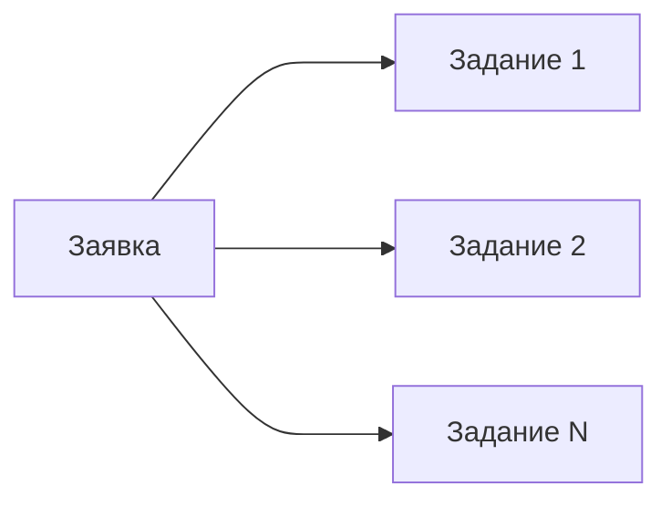

*Последнее редактирование: <%+ tp.file.last_modified_date() %>*

# BuyBack

Или выкуп. 

Покупка товара по [[Order|указанным параметрам]]. С использованием технологии уникализации аккаунтов. 

> [!important] В зависимости от контекста обсуждения, выкупом может являться 
> - [[Order|Заявка]]
> - [[Job|Задание]]
> - [[Task|Задача]]

## В контексте Заявки

Выкуп здесь выступает как заявка. То есть совокупность покупок товара по указанным в заявке параметрам. 

На данном уровне выкуп как заявка может выполняться в двух режимах: 

 - Быстрый выкуп
 - Органичный выкуп

### Быстрый выкуп

Быстрый выкуп означает, что [[Client|клиент]] не создал расписания выкупов (небольшое количество выкупов). То есть указал количество выкупов, которые будут выполнены «прямо сейчас». 

### Органичный выкуп

Органичный выкуп означает, что [[Client|клиент]] создал и настроил [[OrderSchedule|расписание выкупов]]. При таком режиме работы, система имитирует поведение пользователей [[MarketPlace|маркетплейса]] и выкупает [[Article|товарная позиции]] в определенный интервал.

Интервал этот рассчитывается по формуле: 

$$ Количество \: часов \: в \: сутках \;/ \; Количество \: выкупов = Интервал \: выкупов \: в \:течение \: одних \:суток $$

## В контексте Задания

Здесь выкуп выступает как единица задания и часть [[Order|заявки]]. 

В данном контексте нужно смотреть на выкуп, как на часть заявки, который можно прогнать через основной бизнес процесс. Речь идёт о том, что Задание как часть заявки может быть обработано системой, принятно на [[PickupPoint|ПВЗ]] и отправлено на склад фулфилмента. 

## В контексте Задачи

Выкуп здесь выступает как единица работы. 

То есть буквально: 

$$ Один\:выкуп\:товара = Одна\:задача $$

