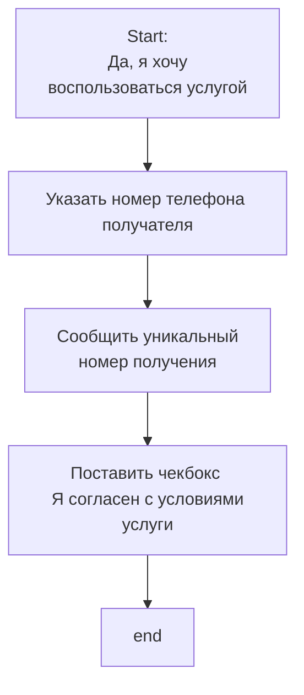

*Последнее редактирование: <%+ tp.file.last_modified_date() %>*

# BuyBackPlus

Или «Выкуп под ключ». Услуга, которую предоставляет сервис [[MP Rating]]. 

Услуга подразумевает, что [[PickupPoint#Партнёрский ПВЗ | представители]] MP Rating **самостоятельно** примут [[Article|товарные позиции]] на [[PickupPoint#Партнёрский ПВЗ | партнёрский ПВЗ]]. И в случае необходимости, отправят эти товарные позиции на [[Fulfilment|склад фулфилмента]].

Услуга «Выкуп под ключ» бывает двух типов: 

1. Клиент может сам забрать товары с партнёрского ПВЗ. Партнёрский ПВЗ забирает товарные позиции по мере их поступления, сортирует их и отмечает необходимый статус. Клиент может эти статусы видеть. И может сам приехать на партнёрский ПВЗ и забрать товары. 
2. Клиент не хочет самостоятельно забирать товары, а хочет чтобы за него это сделал [[Fulfilment|склад фулфилмента]]. Он отправляет данные на [[Fulfilment|фулфилмент]], чтобы тот забрал товарные позиции клиента к себе на склад.

## Алгоритм работы услуги

