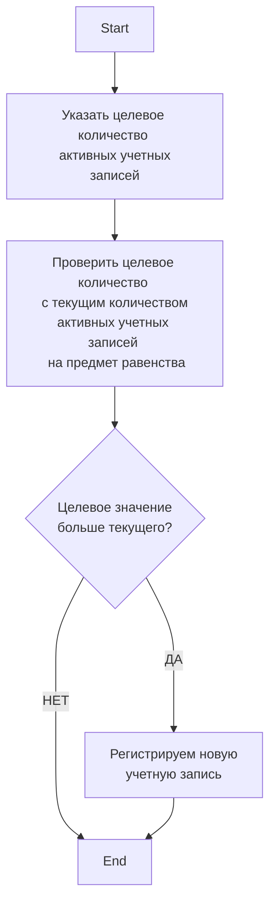
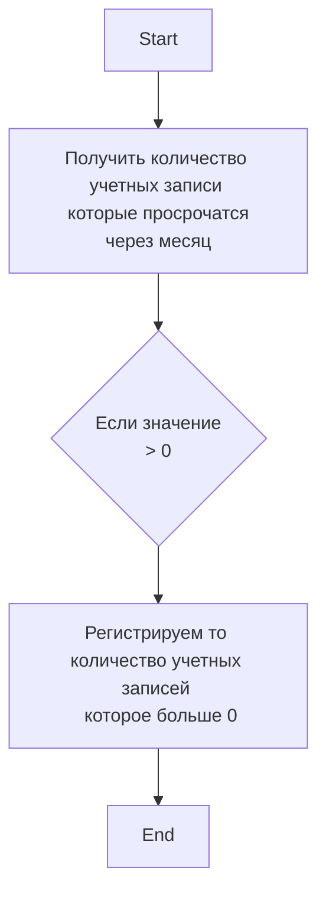

*Последнее редактирование: <%+ tp.file.last_modified_date() %>*

#Finishup 

# MarketPlaceAccount

Или **Учетная запись маркетплейса.** Сущность-актив организации. Учетная запись [[1. Process Marketplace Account Registration | генерируется (создаётся)]] для того, чтобы быть использованной для продвижения [[Article | артикула ]] вверх на [[MarketPlace | маркетплейсе]] в [[Article#Поисковый запрос | поисковой выдаче]].

## Личные данные Учетной записи маркетплейса 

### Номер телефона

>[!info] В текущей реализации
>
>Происходит от провайдера виртуальных онлайн номеров через API. Провайдер: [sms-activate.org.](https://sms-activate.org/ru) 

Формат международный.

### ФИО

- **Текущая реализация:** сгенерировали массив ФИО, используя сторонний онлайн сервис. Массив хранится в табличном файле 

### Пол

- Мужской или Женский

### Дата рождения

- Выбор даты рождения
- YYYY-MM-DD

####  Требования к Дата рождения

- Случайная дата
- Необходимо чтобы на момент регистрации, «человеку» было от 18 и до 60 лет

### Атрибуты уникальности

Атрибуты уникальности — это атрибуты, которые обеспечивают уникальность учетной записи для маркетплейса. 

Атрибуты нужны для того, чтобы проходили отзывы, а также чтобы маркетплейс не накладывал санкции на клиентов.

Маркетплейс должен думать что учетная запись — реальный человек. 

К атрибутам уникальности относятся:  

- User Agent
- Скрытая геолокация
- Уникальный IP Адрес
- *Есть что-то еще, надо исследовать*

>[!note] В текущей реализации 
>
>Мы прячем, что мы (сервис) используем Selenium. 
> ```js
> js.executeScript("Object.defineProperty(navigator, 'webdriver', {get: () => undefined})");```


## Статусы учетной записи

| Статус    | Eng         | Комментарий                                                  |
| --------- | ----------- | ------------------------------------------------------------ |
| Активен   | Active      | Готов к работе. Готов для выкупа.                            |
| Неактивен | OutDated    | Мы больше не имеем доступа к учетной записи на маркетплейсе. |
| Занят     | Busy | Учетная запись находится в действующей [[Order \| заявке.]]  |

## Количество активных учетных записей и поддержание этого количества на должном уровне

Так как маркетплейс через 1 год после даты регистрации, автоматически разлогинивает учетную запись. И к этому моменту доступа к номеру телефона уже нет, то и возможность зайти под этой учетной записью исчезает. 

**По этой причине активные учетные записи имеют ограниченный срок жизни.** 

Чтобы обеспечить *своевременную*  поставку активных учетных записей [[Client|клиентам]], необходимо поддерживать общее количество активных учетных записей на должном уровне. 

Для этого был разработан алгоритм поддержания необходимого количества активных учетных записей. 

### Алгоритм поддержания необходимого количества активных учетных записей 



### Алгоритм поддержания для случая, когда учетная запись близится к статусу Не активен




### Параметры алгоритма поддержания

- Целевое количество активных учетных записей — необходимое количество активных учетных записей в системе. Пользователь должен иметь возможность управлять этим значением. 
- Текущее количество активных учетных записей — активные учетные записи «на сегодняшний день». 

## Метрики учетной записи

Состояние — это отображение информации учетной записи, которое нужно принять во внимание. То есть **это не статус**, но эту информацию нужно показывать в явном виде пользователю. 

Необходимые для отображения состояния учетных записей: 

- **Истекает срок службы учетной записи**. Это состояние, при котором система должна в явном виде, дать информацию о том, что *через 30 дней, учетная запись перейдёт из статуса Активен в Не активен.* 
- Имеет ли выкупы или нет. Информация «related» типа. Пользователь должен иметь возможность посмотреть есть ли выкупы у конкретной учетной записи. И посмотреть список выкупов, связанных с конкретной учетной записью. 
- Целевое количество активных учетных записей.
- Текущее количество активных учетных записей.