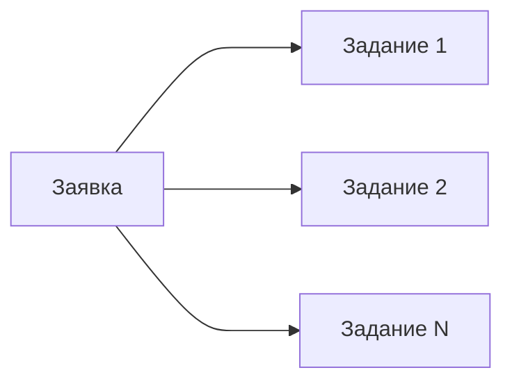

*Последнее редактирование: <%+ tp.file.last_modified_date() %>*

# Order

Или заявка. 

Сущность-спецификация, которая содержит требования и параметры для [[BuyBack | выкупа.]] Заявку создают [[Client|клиенты]] c помощью интерфейса клиентской системы [[MP Rating]]. 

На основе заявки появляется [[Job|задание]]. У заявки может быть множество заданий, например если [[Client|клиент]] создал расписание для заявки. 

>[!warning] Внимание! 
> Одна заявка всегда работает **только с одним артикулом.**
> Два артикула в одной заявке быть не может! 

## Параметры заявкиㅤ

| Параметр                                                             | Описание                                             |
| -------------------------------------------------------------------- | ---------------------------------------------------- |
| Дата создания                                                        | Дата создания заявки.                                |
| [[Article\|Артикул]]                                                 | Артикул товарной позиции, номер.                     |
| [[Article#Размер \| Размер артикула]]                                | Размер артикула.                                     |
| [[Article#Бренд \| Бренд артикула]]                                  | Бренд, если есть.                                    |
| [[Article#Пол \| Пол]]                                               | Пол.                                                 |
| [[Article#Поисковый запрос \| Поисковый запрос]]                     | Поисковый запрос для артикула. Может быть несколько. |
| [[2. Process of creating an Order#Расписание выкупов \| Расписание]] | Расписание есть или нет.                             |
| Количество [[BuyBack\|выкупов]]                                      | Количество выкупов для артикула.                     |
| [[PickupPoint \| ПВЗ]]                                               |                                                      |
| Комментарий к заявке                                                 | Комментарий к заявке.                                |
| Способ оплаты                                                        | Выбранный клиентом способ оплаты                     |
| Статус заявки                                                        |                                                      |
| Номер получателя                                                     |                                                      |
| Клиент                                                               |                                                      |

## Статусы заявки

Список статусов заявки. Возможно список неполный или излишний. В целом он нужен для представления того, что может происходить с заявкой в течение жизни. 

|  №  | Статус                                      |             Eng              | Описание                                                                                                                           |
|:---:| ------------------------------------------- |:----------------------------:| ---------------------------------------------------------------------------------------------------------------------------------- |
|  0  | Новая заявка                                |             New              | Заявка создана клиентом, но еще не запущена в работу. Возможно клиент еще не до конца настроил заявку или не запустил её в работу. |
|  1  | В работе                                    |          InProgress          | Заявка была запущена и находится в работе.                                                                                         |
|  2  | Приостановлена                              |            Paused            | Заявка была приостановлена в процессе работы. По какой-то причине клиент решил приостановить выполнение заявки.                    |
|  3  | Отменена                                    |           Canceled           | Заявка была отменена клиентом. Клиент больше не хочет продолжать выполнение заявки.                                                |
|  4  | Ошибка выполнения                           |            Error             | При выполнении заявки была обнаружена ошибка и выполнение было приостановлено.                                                     |
|  5  | Успешно выполнена                           |           Success            | Заявка была успешно выполнена. Выкуп был совершён.                                                                                 |
|  6  | В пути на ПВЗ                               |    OnTheWayToPickUpPoint     | Заявка находится в пути на ПВЗ.                                                                                                    |
|  7  | Готова к выдаче                             |        ReadyForPickUp        | Заявка готова к тому, чтобы её можно было забрать.                                                                                 |
|  8  | Принята сотрудником ПВЗ                     | ReceivedByPickUpPontOperator | Заявка была принята сотрудником ПВЗ. Сотрудник ПВЗ осуществил «забор».                                                             |
|  9  | Готова для перемещения на склад фулфилмента |    ReadyToMoveToFulfiment    | Заявка была помечена сотрудником ПВЗ как готовая к перемещению на склад фулфилмента.                                               |
| 10  | Передана на склад фулфилмента               |     OnTheWayToFulfilment     | Заявка была передана сотруником ПВЗ сотруднику фулфилмента и находится в пути на склад.                                            |
| 11  | Готова для получения на складе фулфилмента  |   ReadyForFulfilmentPickUp   | Заявка была получена складом фулфилмента и готова к получению клиентом.                                                            | 

## Действия с заявкой

Заявку можно: 

- Создать
- Запустить
- Приостановить
- Перезапустить
- Отменить

## Услуга «Выкуп под ключ»

[[Client|Клиент]], при создании заявки, может подключить услугу [[BuyBackPlus|«выкуп под ключ»]]. 

В таком случае, ему дополнительно нужно будет указать: 

 - Номер телефона получателя товарных позиций
 - [[Client#Уникальный номер получения | Уникальный номер получения]]