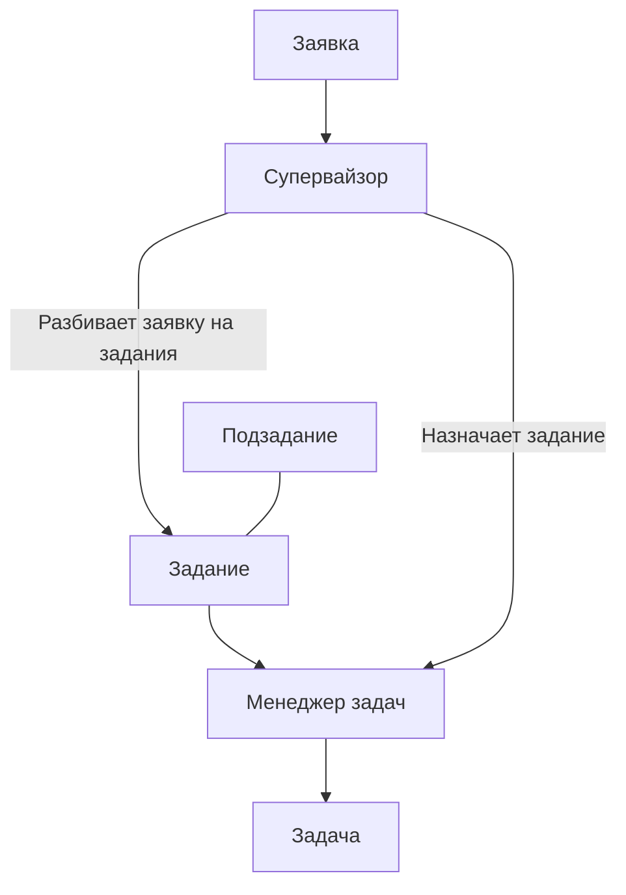

*Последнее редактирование: <%+ tp.file.last_modified_date() %>*

# Supervisor

Супервайзор.

Сервис, служба, которая отвечает за обработку [[Order|заявки]] на «верхнем уровне». Это означает, что заявка, попадая к [[Supervisor | Супервайзору]], делится на [[Job|задание]] и подзадание. 

> [!info] Супервайзор занимается управлением [[Job|заданиями]] и управлением [[TaskManager|менеджерами задач]] 
> 
> На каждое [[Job|задание]], [[Supervisor|супервайзор]] создаёт (назначает) [[TaskManager|менеджера задач]]. Тот в свою очередь, занимается управлением [[Task|задачами]].

Если попытаться изобразить процесс, то выглядеть он будет примерно так: 

### Зачем понадобился супервайзор? 

Так как от [[Client|клиентов]] могут приходит большие задания, например: 

> Сделать выкуп артикула в течение двух недель и чтобы каждый день выкупалось определенное количество артикула
>
> [Еще один пример реального запроса](https://docs.google.com/spreadsheets/d/1mJ57AZVUYY38WTgySPWbua-kNVrx6XaUS2dGhhmDtLE/edit#gid=0) на выкуп от [[Client|клиента]].

[[1. Process Marketplace Account Registration|Процесс регистрации учетной записи маркетплейса]] подразумевает имитацию реального поведения пользователя [[MarketPlace|площадки]] и поэтому этот процесс может занимать время. Здесь речь идёт о процессе выкупа. 

Совокупность вышеуказанной информации, натолкнула на мысль, что процесс обработки задания, нужно распараллеливать и организовать многопоточность.

И тогда появился механизм, который бы делил задание на части и управлял их выполнением. Этим механизмом стал Супервайзор. 

### Алгоритм работы 

[Подробно можно ознакомиться здесь.](https://www.figma.com/file/6k3QTnlqRreODvpZsqD2rK/3.1.-%D0%9E%D0%B1%D1%80%D0%B0%D0%B1%D0%BE%D1%82%D0%BA%D0%B0-%D0%B7%D0%B0%D1%8F%D0%B2%D0%BA%D0%B8%3A-%D0%A1%D1%83%D0%BF%D0%B5%D1%80%D0%B2%D0%B0%D0%B9%D0%B7%D0%BE%D1%80?node-id=0%3A1) 

Но если описать алгоритм вкратце, то: 

1. Супервайзор получает заявку на вход
2. Формирует [[Job|задания]] и подзадания
3. Записывает их в базу данных
4. Проверяет: «Есть подзадания на сегодня?»
	1. Если **НЕТ** заканчивает работу.
	2. Если **ДА** Создаёт [[TaskManager|менеджера задач]]
5. Назначает [[TaskManager|менеджеру задач]] [[Job|задание]]
6. Принимает от [[TaskManager|менеджера задач]] статусы выполнения [[Job|задания]]
	1. Если **ДА**, то «Сообщить [[Client|клиенту]] об успешном выполнении»
	2. Если **НЕТ**, то «Сообщить клиенту об провале»
7. Завершение работы 

### Частота проверки заданий и подзаданий на сегодня

Задания будут приходит в систему регулярно. И для обеспечения регулярного их выполнения Супервайзор должен формировать «очередь выполнения заданий». То есть проверять: есть ли на сегодняшний день задания которые нужно выполнить? 

Проверку можно осуществлять раз в сутки. 

### Создание Менеджера задач и назначение задания

Супервайзор создаёт [[TaskManager|менеджера задач]] для конкретного задания или подзадания исходя из сегодняшнего расписания. Если задание имеется, то супервайзор создаёт под него менеджера задач и назначает ему задание (или подзадание). 

### Проверка статуса выполнения задания

Супервайзор должен «сообщаться» с [[TaskManager|менеджерами задач]], с целью получения от них статуса выполнения задания. 

Мы должны понимать, было выполнено задание или нет. И если нет, то почему. 